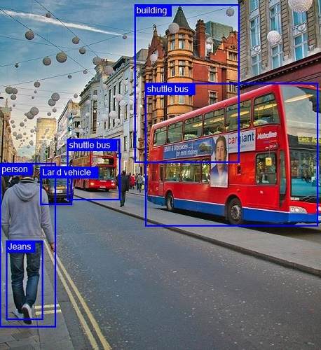
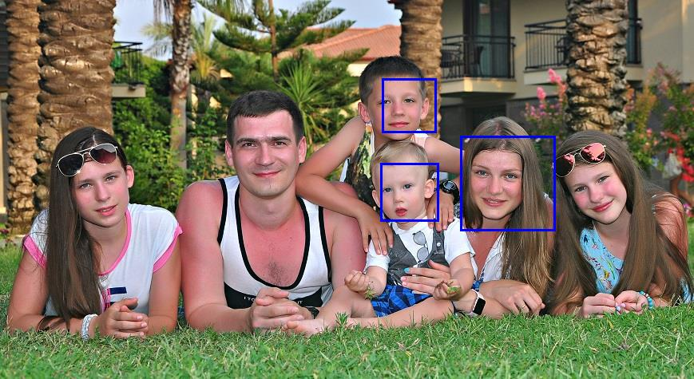
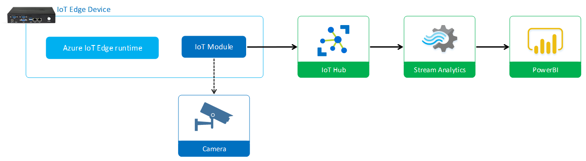

# Computer Vision

Sample solutions presented on Global Azure Bootcamp 2019.
Event: 

## Examples

### Azure based Computer Vision

.NET solution which uses Azure Cognitive Service to detect objects in web-camera feed.

[Read more...](azure-cognitive-csharp)

### OpenCV based Computer Vision

.NET solution based on OpenCV library and haarcascade_profileface.xml model which detect profile faces in camera feed.

[Read more...](opencv-csharp)

### OpenVINO based Computer Vision (C++)

Application based on OpenVINO to detect objects, faces and recognize age, gender and emotions.

")

[Read more...](openvino-cpp)

### OpenVINO based Computer Vision

Python app which detects faces with OpenVINO and send data to Azure IoT Hub.

[Read more...](openvino-python)