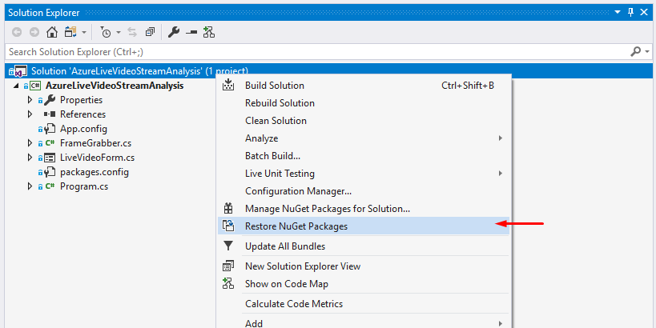

# Azure based Computer Vision

Object detection in camera stream with Azure Custom Vision service.

## Prerequisites

### 1. Azure Subscription

First of all you need active Azure Subscription. In case you don't have one yet just follow this instruction:
[Create your Azure free account today](https://azure.microsoft.com/en-us/free/)

### 2. Azure Custom Vision

The solution based on [Create your Azure free account today](https://azure.microsoft.com/en-us/services/cognitive-services/custom-vision-service). You need to create custom vision resource to run the example:


### 3. Nuget packages

The solution uses the following nuget packages:

- Microsoft.Azure.CognitiveServices.Vision.ComputerVision
- Newtonsoft.Json
- OpenCvSharp3

## Run the sample

Clone the repository:

```
git clone https://github.com/vzhukov/azure-bootcamp-2019.git
```

Open solution ```azure-cognitive-csharp\AzureLiveVideoStreamAnalysis.sln``` in Visual Studio.

Restore nuget-packages:



Open ```App.config``` and edit update app setting ```AzureCognitiveEndpoint``` with your value from Azure Custom Vision service:


Update app settings ```AzureCognitiveKey``` with your key:


Update app settings ```CameraIndex``` with the device index wich you will use (default web camera index - 0).

Start the application to detect objects:


## How it works

Init video capture for default device (index = 0)
```c#
car reader = new VideoCapture(0);
```

Init Azure custom vision client
```c#
var visionClient = new ComputerVisionClient("AzureCognitiveKey")
    {
        Endpoint = "AzureCognitiveEndpoint"
    };

```

Read frame from camera:
```c#
var image = new Mat();
reader.Read(image);
```

Send image to Azure to recognize objects:
```c#
var imageBytes = image.ToBytes(".jpg");
using (var ms = new MemoryStream(imageBytes))
{
    var task = await visionClient.DetectObjectsInStreamAsync(ms);
}
```

Parse the result:
```c#
var items = task.Objects;
// item.ObjectProperty
// item.Rectangle
```