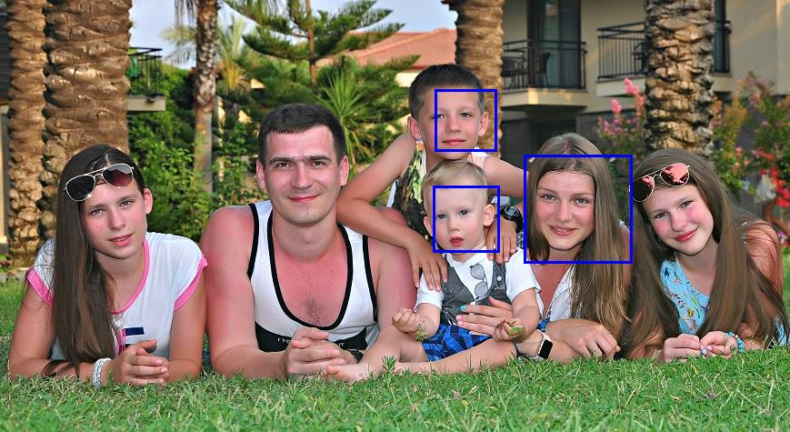

# OpenCV based Computer Vision

Face detection with OpenCV

## Prerequisites

### Nuget packages

The solution uses the following nuget packages:

- [EMGU.CV](https://www.nuget.org/packages/EMGU.CV/)
- [ZedGraph](https://www.nuget.org/packages/ZedGraph/)


## Run the sample

Clone the repository:

```
git clone https://github.com/vzhukov/azure-bootcamp-2019.git
```

Open solution ```opencv-csharp\OpenCVLiveVideoStreamAnalysis.sln``` in Visual Studio.

Restore nuget-packages:


Start the application to detect faces:


