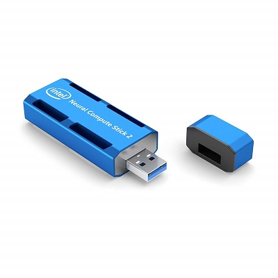
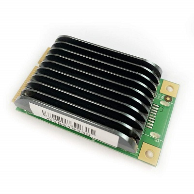

# OpenVINO based Computer Vision (C++)

Multiple detection based on OpenVINO. The solutin detects objects and faces, recognizes age, gender and emotions.

## Prerequisites

### Intel OpenVINO toolkit

https://software.intel.com/en-us/articles/OpenVINO-Install-Linux

### Eclipse

https://www.eclipse.org

### Movidius

Intel movidius chip on the board is required. You can buy USB stick:
https://www.amazon.com/dp/B07KT6361R/ref=cm_sw_em_r_mt_dp_U_zYRXCbKPAZPY7 
or other movidius based hardware in a form-factor you need:




## Run the sample

Clone the repository:

```
git clone https://github.com/vzhukov/azure-bootcamp-2019.git
```

Open project ```openvino-cpp``` in Eclipse.

Build and run the application:


## How it works

Pseudo-code to explain how the application works.

Prepare model and weight in Intel format. You can use [Model Optimizer](https://docs.openvinotoolkit.org/latest/_docs_MO_DG_Deep_Learning_Model_Optimizer_DevGuide.html) to convert TensorFlow, Caffe, MXNet or ONNX models into Intel format.

Prepared model and weights:
```c++
string modelXml = "./models/face-detection-adas-0001.xml";
string modelBin = "./models/face-detection-adas-0001.bin";
```

Init movidius device:
```c++
InferencePlugin plugin = PluginDispatcher( { "" }).getPluginByDevice("MYRIAD");
```

Init network reader and load .xml and .bin files:
```c++
CNNNetReader netReader;
netReader.ReadNetwork(modelXml);
netReader.ReadWeights(modelBin);
```

Getting information about input and output of the network
```c++
InputsDataMap inputInfo(netReader.getNetwork().getInputsInfo());
string inputName = inputInfo.begin()->first;

OutputsDataMap outputInfo(netReader.getNetwork().getOutputsInfo());
string outputName = outputInfo.begin()->first;

CNNNetwork networkInfo = netReader.getNetwork();
```

Load network to movidius device:
```c++
map<string, string> config;
ExecutableNetwork network = plugin.LoadNetwork(networkInfo, config);
```

Init new request and send it to the network:
```c++
InferRequest::Ptr request = network.CreateInferRequestPtr();
request->Infer();
```

Parse the result:
```c++
auto buffer = request->GetBlob(outputName)->buffer();
const float *detections = buffer.as<float *>();
```